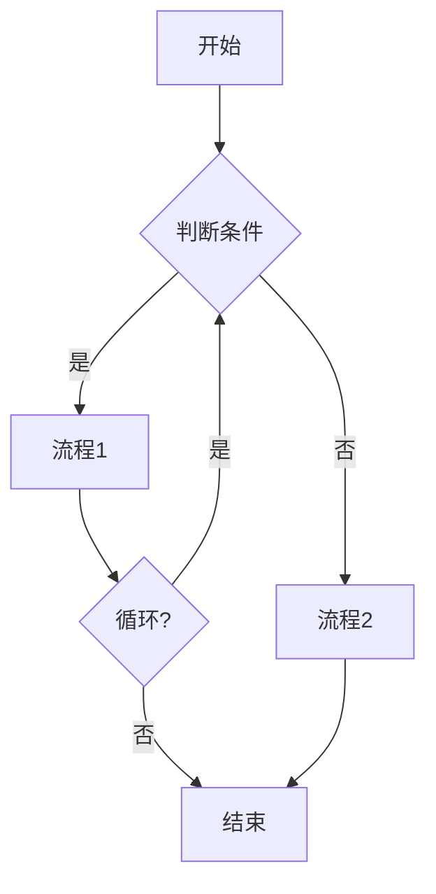

# PDD-Business Analysis - 业务分析技能

## 1. 技能概述

### 1.1 核心定位
运用专业方法论进行需求分析和业务建模，输出结构化的业务分析结果，为后续功能点提取和开发规格生成提供基础。

### 1.2 技能边界
- **输入**: PRD文档、业务需求描述、流程说明
- **输出**: 业务分析报告、用例图、流程图、状态图、CRUD矩阵
- **不负责**: 代码实现、测试编写、架构设计

## 2. 方法论工具箱

### 2.1 5W1H 分析法

用于全面理解业务需求的六个维度：

| 维度 | 问题 | 分析要点 |
|------|------|---------|
| **Why** | 为什么做？ | 业务背景、目标、价值 |
| **What** | 做什么？ | 功能范围、业务内容 |
| **Who** | 谁来做？ | 角色划分、职责边界 |
| **When** | 何时做？ | 时间要求、里程碑 |
| **Where** | 在哪做？ | 使用场景、环境 |
| **How** | 怎么做？ | 实现方式、流程 |

### 2.2 MECE 原则

确保业务分析无遗漏、无重叠：

```
MECE (Mutually Exclusive, Collectively Exhaustive)
├── 相互独立：各分析项不交叉重叠
└── 完全穷尽：覆盖所有业务场景
```

**MECE 检验清单**：
- [ ] 子类别是否相互独立？
- [ ] 所有类别是否覆盖完整？
- [ ] 是否有遗漏的业务场景？
- [ ] 是否有重叠的功能定义？

### 2.3 CRUD 矩阵

分析实体与操作的对应关系：

| 实体 | Create | Read | Update | Delete |
|------|--------|------|--------|--------|
| 用户 | ✓ | ✓ | ✓ | ✓ |
| 角色 | ✓ | ✓ | ✓ | ✓ |
| 权限 | ✓ | ✓ | ✓ | ✓ |
| 菜单 | ✓ | ✓ | ✓ | ✓ |

## 3. 分析流程

### Step 1: 需求收集

**收集内容**：
- PRD文档原文
- 业务流程描述
- 业务规则文档
- 现有系统截图/文档
- 竞品分析资料

**输出**: 原始需求清单

### Step 2: 5W1H 分析

对每个需求进行5W1H分析：

```
需求编号: REQ-001
需求名称: [名称]

Why (为什么):
  - 业务背景: [描述]
  - 核心价值: [描述]
  - 成功标准: [描述]

What (做什么):
  - 功能描述: [描述]
  - 范围边界: [描述]
  - 不做事项: [描述]

Who (谁):
  - 发起角色: [角色]
  - 参与角色: [角色]
  - 审批角色: [角色]
  - 受益角色: [角色]

When (何时):
  - 开始时间: [时间点]
  - 结束时间: [时间点]
  - 周期特性: [实时/周期/事件]

Where (在哪):
  - 使用场景: [描述]
  - 使用环境: [描述]
  - 接入方式: [描述]

How (怎么做):
  - 实现方式: [描述]
  - 关键流程: [描述]
  - 技术约束: [描述]
```

### Step 3: 业务建模

**a. 用例图 (Use Case Diagram)**

```mermaid
graph LR
    A((发起者)) -->|操作| B[用例]
    C((参与者)] -->|操作| B
    B --> D[用例]
    B --> E[用例]
```

**用例模板**:
```markdown
### UC-[编号]: [用例名称]

**参与者**: [主要参与者]
**前置条件**: [进入系统前的状态]
**后置条件**: [成功完成后的状态]
**基本流程**:
1. [步骤1]
2. [步骤2]
3. [步骤3]

**扩展流程**:
- [条件A]: [扩展1]
- [条件B]: [扩展2]

**异常流程**:
- [异常1]: [处理方式]
- [异常2]: [处理方式]
```

**b. 流程图 (Process Flow)**



**c. 状态图 (State Diagram)**


**状态定义模板**:
```markdown
### 实体状态机

**实体**: [实体名称]
**状态列表**:
| 状态 | 代码 | 含义 | 可转入 |
|------|------|------|--------|
| 草稿 | DRAFT | 初始状态 | SUBMITTED |
| 已提交 | SUBMITTED | 已提交待审核 | APPROVED, REJECTED |
| 已审批 | APPROVED | 审批通过 | ARCHIVED |
| 已拒绝 | REJECTED | 审批拒绝 | DRAFT |
```

### Step 4: CRUD 矩阵生成

```markdown
### CRUD 矩阵

| 实体 | 创建 | 读取 | 更新 | 删除 | 列表 | 导出 |
|------|------|------|------|------|------|------|
| 用户 | ✓ | ✓ | ✓ | ✓ | ✓ | ✓ |
| 角色 | ✓ | ✓ | ✓ | ✓ | ✓ | ✓ |
```

### Step 5: 业务规则提取

```markdown
### 业务规则

| 规则ID | 规则描述 | 约束类型 | 优先级 |
|--------|---------|---------|--------|
| BR-001 | 转账金额不能为负 | 硬性规则 | P0 |
| BR-002 | 审批人不能是申请人 | 硬性规则 | P0 |
| BR-003 | 建议定期更换密码 | 软性规则 | P1 |
```

## 4. 输出规范

### 4.1 业务分析报告结构

```markdown
# [模块名称] 业务分析报告

## 1. 概述
### 1.1 文档信息
| 项目 | 内容 |
|------|------|
| 模块编号 | [编号] |
| 模块名称 | [名称] |
| 分析日期 | [日期] |
| 分析人 | [姓名] |
| 版本 | v1.0 |

### 1.2 业务背景
[业务背景描述]

### 1.3 目标与价值
[目标与价值描述]

## 2. 5W1H 分析
[详见 3.2 节]

## 3. 用例分析
[详见 3.3.a 节]

## 4. 流程分析
[详见 3.3.b 节]

## 5. 状态分析
[详见 3.3.c 节]

## 6. CRUD 矩阵
[详见 3.4 节]

## 7. 业务规则
[详见 3.5 节]

## 8. 风险与假设
### 8.1 风险
| 风险ID | 风险描述 | 影响 | 概率 | 应对 |
|--------|---------|------|------|------|
| R-001 | [描述] | [影响] | [概率] | [应对] |

### 8.2 假设
| 假设ID | 假设描述 | 验证方式 |
|--------|---------|---------|
| A-001 | [描述] | [验证] |

## 9. 附录
### 9.1 术语表
| 术语 | 定义 |
|------|------|
| [术语] | [定义] |

### 9.2 参考文档
- [文档1]
- [文档2]
```

## 5. Guardrails

### 5.1 必须遵守
- [ ] 每个需求必须有明确的5W1H分析
- [ ] 每个业务实体必须有状态定义
- [ ] CRUD矩阵必须覆盖所有业务操作
- [ ] 业务规则必须标注优先级

### 5.2 避免事项
- ❌ 遗漏关键业务流程
- ❌ 状态定义不完整或不互斥
- ❌ 业务规则与实际业务不符
- ❌ 用例与流程描述不一致

## 6. 与其他技能协作

| 协作技能 | 协作方式 | 传入数据 | 期望输出 |
|---------|---------|---------|---------|
| **pdd-main** | 流程调度 | 分析请求 | 业务分析报告 |
| **pdd-extract-features** | Sequential | 分析报告 | 功能点矩阵 |
| **pdd-generate-spec** | Sequential | 分析报告 | 开发规格 |

## 7. 示例

### 7.1 输入示例

```
用户: 分析国有产权转让的业务需求
PRD文档: docs/PRDs/ZCCZ-1-PRD.md
```

### 7.2 输出示例

```markdown
# 国有产权转让 业务分析报告

## 1. 概述
| 项目 | 内容 |
|------|------|
| 模块编号 | ZCCZ-1 |
| 模块名称 | 国有产权（股权）转让 |
| 分析日期 | 2026-03-21 |

## 2. 5W1H 分析 (示例: 转让申请)

| 维度 | 分析 |
|------|------|
| Why | 规范国有资产转让流程，防止国有资产流失 |
| What | 转让申请、审核、挂牌、交易、结算全流程 |
| Who | 子公司经办人、集团审批人、交易所 |
| When | 依据国资委规定的时间节点 |
| Where | 资产管理系统 + 外部交易所系统 |
| How | 线上申请+审批，线下交易+结算 |

## 3. 用例图
[用例图]

## 4. 状态图
[状态图]

## 5. CRUD 矩阵
[CRUD矩阵]
```

## 8. 版本历史

| 版本 | 日期 | 变更内容 |
|-----|------|---------|
| 2.0 | 2026-03-21 | 增强方法论指导，添加MECE检验清单 |
| 1.0 | 早期 | 初始版本 |
