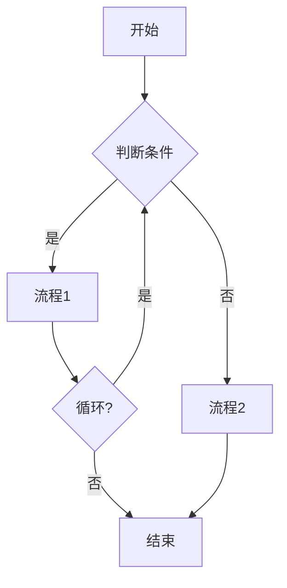

# PDD-Business Analysis - Business Analysis Skill

## 1. Skill Overview

### 1.1 Core Positioning
Applies professional methodologies for requirements analysis and business modeling, outputs structured business analysis results, and provides a foundation for subsequent feature extraction and development specification generation.

### 1.2 Skill Boundaries
- **Input**: PRD documents, business requirement descriptions, process descriptions
- **Output**: Business analysis reports, use case diagrams, process diagrams, state diagrams, CRUD matrices
- **Not responsible for**: Code implementation, test writing, architecture design

## 2. Methodology Toolbox

### 2.1 5W1H Analysis Method

Six dimensions for comprehensively understanding business requirements:

| Dimension | Question | Analysis Points |
|------|------|---------|
| **Why** | Why do it? | Business background, objectives, value |
| **What** | What to do? | Functional scope, business content |
| **Who** | Who does it? | Role division, responsibility boundaries |
| **When** | When to do it? | Time requirements, milestones |
| **Where** | Where to do it? | Usage scenarios, environment |
| **How** | How to do it? | Implementation methods, processes |

### 2.2 MECE Principle

Ensures business analysis is complete and non-overlapping:

```
MECE (Mutually Exclusive, Collectively Exhaustive)
├── Mutually Exclusive: Each analysis item does not overlap
└── Collectively Exhaustive: Covers all business scenarios
```

**MECE Checklist**:
- [ ] Are subcategories mutually exclusive?
- [ ] Are all categories completely covered?
- [ ] Are there any missing business scenarios?
- [ ] Are there any overlapping function definitions?

### 2.3 CRUD Matrix

Analyze the correspondence between entities and operations:

| Entity | Create | Read | Update | Delete |
|------|--------|------|--------|--------|
| User | ✓ | ✓ | ✓ | ✓ |
| Role | ✓ | ✓ | ✓ | ✓ |
| Permission | ✓ | ✓ | ✓ | ✓ |
| Menu | ✓ | ✓ | ✓ | ✓ |

## 3. Analysis Process

### Step 1: Requirements Collection

**Collection Content**:
- Original PRD document
- Business process description
- Business rules document
- Existing system screenshots/documents
- Competitive analysis materials

**Output**: Raw requirements list

### Step 2: 5W1H Analysis

Perform 5W1H analysis for each requirement:

```
Requirement ID: REQ-001
Requirement Name: [Name]

Why:
  - Business Background: [Description]
  - Core Value: [Description]
  - Success Criteria: [Description]

What:
  - Function Description: [Description]
  - Scope Boundaries: [Description]
  - Out of Scope: [Description]

Who:
  - Initiator Role: [Role]
  - Participant Roles: [Roles]
  - Approver Roles: [Roles]
  - Beneficiary Roles: [Roles]

When:
  - Start Time: [Time Point]
  - End Time: [Time Point]
  - Cycle Characteristics: [Real-time/Periodic/Event]

Where:
  - Usage Scenario: [Description]
  - Usage Environment: [Description]
  - Access Method: [Description]

How:
  - Implementation Method: [Description]
  - Key Processes: [Description]
  - Technical Constraints: [Description]
```

### Step 3: Business Modeling

**a. Use Case Diagram**

```mermaid
graph LR
    A((发起者)) -->|操作| B[用例]
    C((参与者)] -->|操作| B
    B --> D[用例]
    B --> E[用例]
```

**Use Case Template**:
```markdown
### UC-[Number]: [Use Case Name]

**Actors**: [Primary Actor]
**Preconditions**: [State before entering the system]
**Postconditions**: [State after successful completion]
**Basic Flow**:
1. [Step 1]
2. [Step 2]
3. [Step 3]

**Extended Flow**:
- [Condition A]: [Extension 1]
- [Condition B]: [Extension 2]

**Exception Flow**:
- [Exception 1]: [Handling Method]
- [Exception 2]: [Handling Method]
```

**b. Process Flow Diagram**



**c. State Diagram**


**State Definition Template**:
```markdown
### Entity State Machine

**Entity**: [Entity Name]
**State List**:
| State | Code | Meaning | Can Transition To |
|------|------|------|--------|
| Draft | DRAFT | Initial state | SUBMITTED |
| Submitted | SUBMITTED | Submitted for review | APPROVED, REJECTED |
| Approved | APPROVED | Approval passed | ARCHIVED |
| Rejected | REJECTED | Approval rejected | DRAFT |
```

### Step 4: CRUD Matrix Generation

```markdown
### CRUD Matrix

| Entity | Create | Read | Update | Delete | List | Export |
|------|------|------|------|------|------|------|
| User | ✓ | ✓ | ✓ | ✓ | ✓ | ✓ |
| Role | ✓ | ✓ | ✓ | ✓ | ✓ | ✓ |
```

### Step 5: Business Rule Extraction

```markdown
### Business Rules

| Rule ID | Rule Description | Constraint Type | Priority |
|--------|---------|---------|--------|
| BR-001 | Transfer amount cannot be negative | Hard Rule | P0 |
| BR-002 | Approver cannot be the applicant | Hard Rule | P0 |
| BR-003 | Recommend changing password regularly | Soft Rule | P1 |
```

## 4. Output Specification

### 4.1 Business Analysis Report Structure

```markdown
# [Module Name] Business Analysis Report

## 1. Overview
### 1.1 Document Information
| Item | Content |
|------|------|
| Module ID | [ID] |
| Module Name | [Name] |
| Analysis Date | [Date] |
| Analyst | [Name] |
| Version | v1.0 |

### 1.2 Business Background
[Business background description]

### 1.3 Objectives and Value
[Objectives and value description]

## 2. 5W1H Analysis
[See Section 3.2]

## 3. Use Case Analysis
[See Section 3.3.a]

## 4. Process Analysis
[See Section 3.3.b]

## 5. State Analysis
[See Section 3.3.c]

## 6. CRUD Matrix
[See Section 3.4]

## 7. Business Rules
[See Section 3.5]

## 8. Risks and Assumptions
### 8.1 Risks
| Risk ID | Risk Description | Impact | Probability | Response |
|--------|---------|------|------|------|
| R-001 | [Description] | [Impact] | [Probability] | [Response] |

### 8.2 Assumptions
| Assumption ID | Assumption Description | Validation Method |
|--------|---------|---------|
| A-001 | [Description] | [Validation] |

## 9. Appendix
### 9.1 Glossary
| Term | Definition |
|------|------|
| [Term] | [Definition] |

### 9.2 Reference Documents
- [Document 1]
- [Document 2]
```

## 5. Guardrails

### 5.1 Must Follow
- [ ] Each requirement must have clear 5W1H analysis
- [ ] Each business entity must have state definitions
- [ ] CRUD matrix must cover all business operations
- [ ] Business rules must be marked with priority

### 5.2 Things to Avoid
- ❌ Missing key business processes
- ❌ Incomplete or non-exclusive state definitions
- ❌ Business rules inconsistent with actual business
- ❌ Use cases inconsistent with process descriptions

## 6. Collaboration with Other Skills

| Collaborative Skill | Collaboration Method | Input Data | Expected Output |
|---------|---------|---------|---------|
| **pdd-main** | Process orchestration | Analysis request | Business analysis report |
| **pdd-extract-features** | Sequential | Analysis report | Feature matrix |
| **pdd-generate-spec** | Sequential | Analysis report | Development specification |

## 7. Examples

### 7.1 Input Example

```
User: Analyze the business requirements for property rights transfer
PRD Document: docs/PRDs/ZCCZ-1-PRD.md
```

### 7.2 Output Example

```markdown
# Property Rights Transfer Business Analysis Report

## 1. Overview
| Item | Content |
|------|------|
| Module ID | ZCCZ-1 |
| Module Name | Property Rights (Equity) Transfer |
| Analysis Date | 2026-03-21 |

## 2. 5W1H Analysis (Example: Transfer Application)

| Dimension | Analysis |
|------|------|
| Why | Standardize asset transfer process, ensure compliant asset circulation |
| What | Full process of transfer application, review, listing, transaction, settlement |
| Who | Subsidiary operator, group approver, exchange |
| When | According to SASAC prescribed time nodes |
| Where | Asset management system + External exchange system |
| How | Online application + approval, offline transaction + settlement |

## 3. Use Case Diagram
[Use Case Diagram]

## 4. State Diagram
[State Diagram]

## 5. CRUD Matrix
[CRUD Matrix]
```

## 8. Version History

| Version | Date | Change Content |
|-----|------|---------|
| 2.0 | 2026-03-21 | Enhanced methodology guidance, added MECE checklist |
| 1.0 | Early | Initial version |
